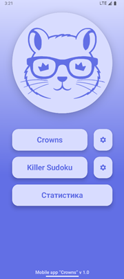
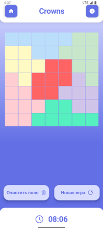
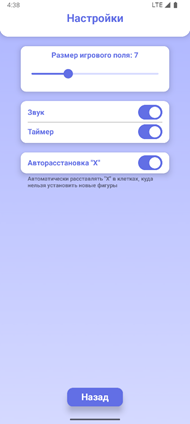
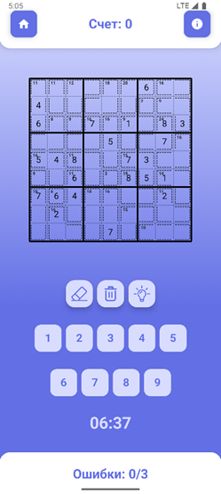
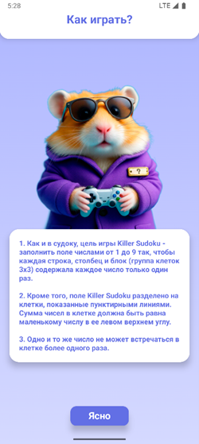
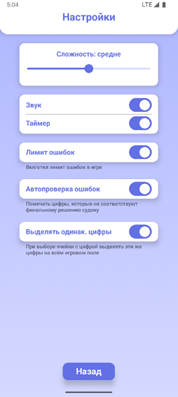
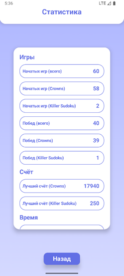
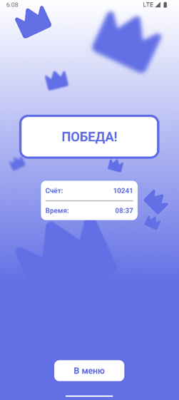

# **МОБИЛЬНАЯ ИГРА «CROWNS»**
## СОДЕРЖАНИЕ
[1. НАЗНАЧЕНИЕ ПРОГРАММЫ](#_nasProg)

[2. УСЛОВИЯ ВЫПОЛНЕНИЯ ПРОГРАММЫ](#_uslovia)

[3. ВЫПОЛНЕНИЕ ПРОГРАММЫ](#_vypolnenie)

1. **НАЗНАЧЕНИЕ ПРОГРАММЫ**

**1. 1. Функциональное назначение**
Мобильная игра “Crowns” имеет развлекательное назначение. Данное приложение предоставляет возможность пользователю проверить свое логическое и пространственное мышление в процессе решения различных конфигураций головоломок. Приложения позволяет настроить сложность каждого режима, что помогает избегать быстрого надоедания и поддерживать пользовательский интерес к игре.

**1.2. Эксплутационное назначение**
Основными конечными потребителями разрабатываемого приложения являются подростки, взрослые, а также пожилые люди, которые хотят попробовать себя в решении головоломок.  Наличие двух игровых режимов с настраиваемой сложностью и понятного интерфейса будет способствовать приросту числа пользователей. 

2. **УСЛОВИЯ ВЫПОЛНЕНИЯ ПРОГРАММЫ**

**2.1. Минимальный состав аппаратных средств**
Для бесперебойной работы приложения требуется:
•	Мобильное устройство с операционной системой Android версии 7.0 (API 24) и выше, оснащенное 64-разрядным (ARMv8/x64) процессором.
•	256 МБ оперативной памяти (ОЗУ) или больше.
•	100 МБ свободного места на внутреннем накопителе или больше.

**2.2. Минимальный состав программных средств**
Во время испытаний должны быть использованы следующие программные средства:
•	Среда разработки Android Studio Koala Feature Drop | 2024.1.2
•	Устройство с операционной системой версии 14 и выше

**2.3. Требования к персоналу (пользователю)**
Для корректной работы программы достаточно одного человека. Оператор не должен обладать какими-либо особыми знаниями или навыками для использования данного ПО.

3. **ВЫПОЛНЕНИЕ ПРОГРАММЫ**

**3.1. Установка программы**
Для запуска программы сначала необходимо загрузить ее актуальную версию из репозитория, который находится по ссылке: https://github.com/Allonso0/Crowns (загрузка свободная и не требует регистрации или каких-либо других действий).
Далее необходимо подключить устройство к компьютеру, включить режим разработчика и активировать отладку по USB. Затем открыть данный проект в Android Studio и в устройствах для запуска приложения выбрать подключенное устройство. Приложения автоматически загрузится на устройство и его можно будет запустить.

**3.2. Запуск программы и работа с приложением**
После запуска приложения пользователь попадает на главный экран, откуда, с помощью соответствующих кнопок, он может попасть на экран режима Crowns, экран режима Killer Sudoku, экраны настроек этих режимов и на экран статистики. 

**3.2.1. Главный экран приложения**

В верхней части экрана располагается логотип приложения. Нажатия на него не предусмотрены.
Под логотипом вертикально по центру находится кнопка для перехода на экран режима Crowns.  При ее нажатии пользователь попадает на соответствующий экран. Если пользователь еще не начинал играть в данный режим или если он не открывал экран после завершения последней игры, то на экране режима сгенерируется новое пустое игровое поле того размера, что установлен в настройках. Если приложение только было запущено, то при нажатии данной кнопки на некоторое время может появиться экран загрузки.
Справа от этой кнопки расположена кнопка для перехода на экран настроек режима Crowns. Если пользователь впервые запустил приложение, то в приложении будут установлены настройки по умолчанию.
Под кнопкой для перехода на экран режима Crowns располагается кнопка для перехода на экран режима Killer Sudoku. Если пользователь еще не начинал играть в данный режим или если он не открывал экран после завершения последней игры, то на экране режима сгенерируется новое пустое игровое поле с параметрами сложности, заданными в настройках. Если приложение только было запущено, то при нажатии данной кнопки на некоторое время может появиться экран загрузки.
Справа от этой кнопки расположена кнопка для перехода на экран настроек режима Killer Sudoku. Если пользователь впервые запустил приложение, то в приложении будут установлены настройки по умолчанию.
Самая нижняя кнопка предназначена для перехода на экран статистики. Там пользователь может просмотреть игровую статистику по обоим игровым режимам.

**3.2.2. Экран режима Crowns**

В верхней части экрана находится “тулбар”, содержащий текстовое поле с названием режима и две кнопки. Кнопка в левой части с иконкой дома предназначена для возвращения на главный экран приложения. Кнопка в правой части предназначена для перехода на экран с правилами режима Crowns. На главный экран приложение также можно вернуться с помощью жеста “назад”.
Под тулбаром находится игровое поле режима Crowns размера NxN клеток, разбитых на N цветовых регионов, где N – число от 5 до 12, выбираемое пользователем на экране настроек режима Crowns (по умолчанию 5). При нажатии на ячейку поля происходит следующее:

1) Если опция “Авторасстановка Х” включена, то при нажатии в ячейку ставится “корона”, а во все ячейки, которые находятся в “ударной области” короны, ставятся “крестики”. При нажатии на ячейку с крестиком ничего не происходит. При нажатии на ячейку с короной, ячейка становится пустой, а все крестики из ударной области короны удаляются (если не находятся в ударной области другой короны).

2) Если опция “Авто расстановка Х” выключена, то при нажатии на пустую ячейку поля в ней ставится крестик. При нажатии на крестик, в ячейке ставится корона. При нажатии на корону, ячейка вновь становится пустой.

В нижней части экрана находится таймер, который отсчитывает время, прошедшее с момента начала уровня. Таймер отображается, если включена соответствующая опция в настройках. Таймер ведет отсчет только когда экран режима открыт.
Над таймером располагаются две кнопки. При нажатии на кнопку “Очистить поле” с иконкой мусорного ведра игровое поле очищается, то есть все ячейки на поле становятся пустыми. При нажатии на кнопку “Новая игра” с иконкой круглой стрелки появляется “всплывающее окно” с просьбой подтвердить пользователя свое действие. Если пользователь нажимает “Нет” или нажимает на экран вне всплывающего окна, то оно закрывается. Если пользователь нажимает “Да”, то генерируется новое поле заданного в настройках размера, а таймер обнуляется.

**3.2.3. Экран с правилами режима Crowns**

Экран с правилами режима Crowns содержит текстовое поле с описанием правил режима и кнопку с надписью “Ясно” для возврата на экран режима Crowns. Вернуться на экран с игровым полем можно также с помощью кнопки или жеста “Назад”, поддерживаемого устройством пользователя.

**3.2.4. Экран с настройками режима Crowns**

**3.2.5. Экран режима Killer Sudoku**

В верхней части экрана находится тулбар, содержащий текстовое поле с текущим счетом, а также две кнопки: кнопка слева – для возврата на главный экран приложения, кнопка справа – для перехода на экран с правилами режима. Кнопки аналогичны кнопкам на экране режима Crowns (см. п. 3.2.2.).
В нижней части экрана находится счетчик ошибок. Он отображает текущее количество совершенным пользователем ошибок. Если количество ошибок станет равно 3, то пользователю засчитается поражение и откроется соответствующий экран. Лимит ошибок можно отключить в настройках. В таком случае пользователь не может проиграть, а счетчик ошибок не отображается на экране. 
Над счетчиком ошибок располагается таймер, который отображает время, прошедшее с момента начала уровня. Таймер ведет отсчет только если экран режима открыт. Отображение таймера можно отключить в настройках.
Над таймером отображается цифровая клавиатура, которая содержит цифры от 1 до 9 и нужна для заполнения ячеек поля Killer Sudoku.
Над цифровой клавиатурой находится ряд из трех кнопок. Левая кнопка с иконкой ластика нужна для удаления поставленного в ячейку значения. Центральная кнопка со значком мусорного ведра нужна для очистки поля. То есть при нажатии данной кнопки все установленные пользователем значения удаляются из ячеек. Правая кнопка нужная для получения пользователем подсказок. При нажатии на нее случайная пустая ячейка поля заполняется правильным значением. Поставленная цифра выделяется зеленым цветом.
Между верхним тулбаром и тремя кнопками действий располагается игровое поле Killer Sudoku, которое представляет из себя квадрат 9 на 9 клеток, разбитый на 9 квадратов (3 на 3 клетки каждый). Также случайным образом для каждого поля генерируется конфигурация “клеток”. В случайных ячейках сгенерированного поля уже проставлены правильные значения, их количество зависит от выбранной в настройках сложности. При нажатии на ячейку поля происходит следующее:

1) Если в ячейке стоит цифра, то все ячейки с такими же цифрами на поле (теми, что уже установлены) подсвечиваются. Это сделано для удобства пользователя. Данную функциональность можно отключить в настройках. Если цифра, установленная в ячейку, была сгенерирована изначально, то ее нельзя ни стереть с помощью кнопки ластика, ни поставить вместо нее другую цифру. Если цифра была установлена пользователем, то ее можно стереть или заменить другой цифрой с помощью цифровой клавиатуры.

2) Если ячейка пустая, то при нажатии на нее, а затем на кнопку цифровой клавиатуры в данной ячейке ставится соответствующая цифра. Если она поставлена верно, то цифра подсвечивается синим цветом. Если она установлена неверно, то цифра выделяется красным цветом.

**3.2.6. Экран с правилами режима Killer Sudoku**

Экран с правилами режима Killer Sudoku содержит текстовое поле с описанием правил режима и кнопку с надписью “Ясно” для возврата на экран режима Killer Sudoku. Вернуться на экран с игровым полем можно также с помощью кнопки или жеста “Назад”, поддерживаемого устройством пользователя.

**3.2.7. Экран с настройками режима Killer Sudoku**

Экран настроек режима Killer Sudoku в нижней части содержит кнопку с надписью “Назад” для возврата на главный экран приложения. Вернуться на главный экран можно также с помощью кнопки или жеста “Назад”, поддерживаемого устройством пользователя.
Под заголовком экрана, находящемся в верхней части экрана находится окно с настройкой сложности режима Killer Sudoku. Настройка производится с помощью графического компоненты slider. При установке значения, в следующей начатой пользователем игре будет сгенерировано поле установленной сложности.
Ниже окна с настройкой размера игрового поля находится окно с настройками “Звук” и “Таймер”. Графический компонент “switch”, находящийся напротив первой настройки, отвечает за включение или отключение звукового сопровождения во время игры. Switch, находящийся напротив второй настройки, отвечает за отображение таймера на экране режима.
Ниже окна с настройками звука и таймера находится окно с настройкой лимита ошибок. Располагающийся в этом окне switch отвечает за включение или отключение данной опции. В пункте 3.2.5. можно прочитать, за что отвечает данная настройка.
Ниже окна с настройкой лимита ошибок располагается окно с настройкой опции автопроверки ошибок. При включенной настройке на игровом поле неправильно установленные цифры отмечаются красным цветом. При выключенной опции неправильно установленные цифры отмечаются синим цветом.
Ниже окна с настройкой опции автопроверки ошибок находится окно с настройкой выделения одинаковых цифр. Если данная опция включена, то при выборе ячейки с цифрой, ячейки с такой же цифрой подсвечиваются по всему полю.

**3.2.8. Экран статистики**

Экран статистики в нижней части содержит кнопку с надписью “Назад” для возврата на главный экран приложения. Вернуться на главный экран можно также с помощью кнопки или жеста “Назад”, поддерживаемого устройством пользователя.
По центру экрана располагается окно со статистикой пользователя по обоим игровым режимам. Список содержит несколько заголовков разделов: “Игры”, “Счет”, “Время”. Список можно пролистывать с помощью жеста “свайп”.

**3.2.9. Экран победы**

Экран победы в нижней части содержит кнопку с надписью “В меню” для возврата на главный экран приложения. Вернуться на главный экран можно также с помощью кнопки или жеста “Назад”, поддерживаемого устройством пользователя.
По центру экрана расположено окно с информацией об итоговом счете пользователя и об итоговом времени, которое пользователь потратил на уровень.

**3.2.10. Экран поражения**

Экран победы в нижней части содержит кнопку с надписью “В меню” для возврата на главный экран приложения. Вернуться на главный экран можно также с помощью кнопки или жеста “Назад”, поддерживаемого устройством пользователя.